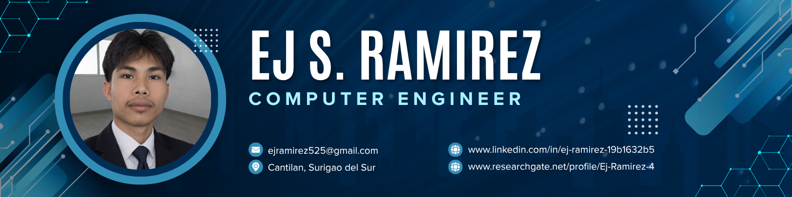
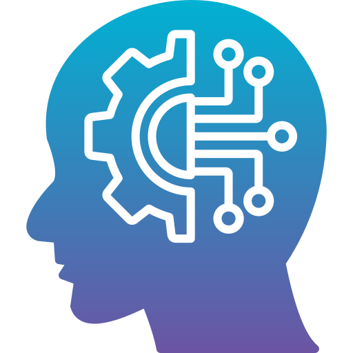
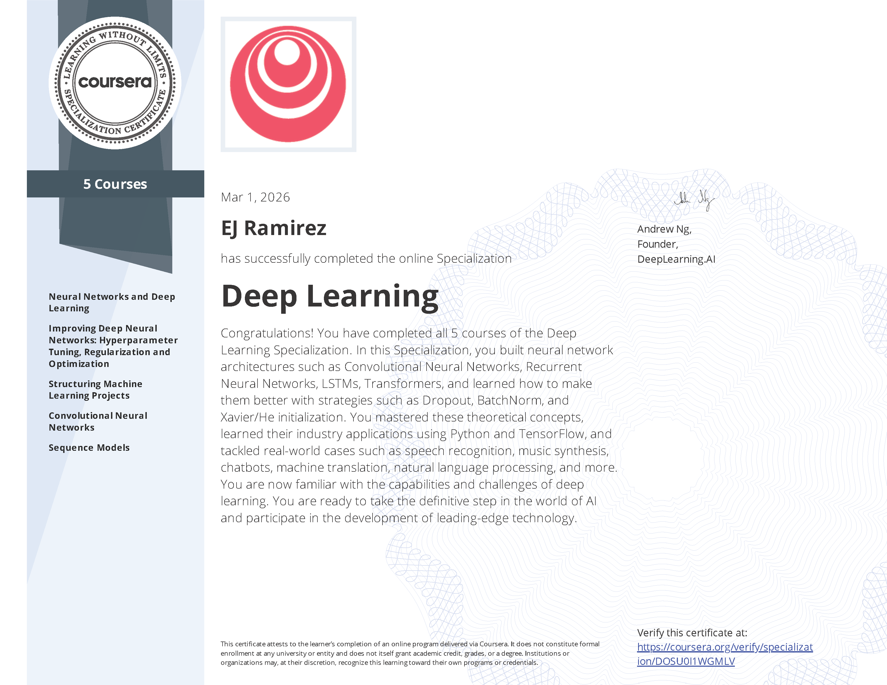
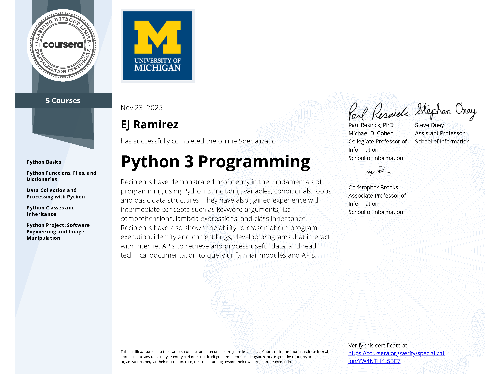
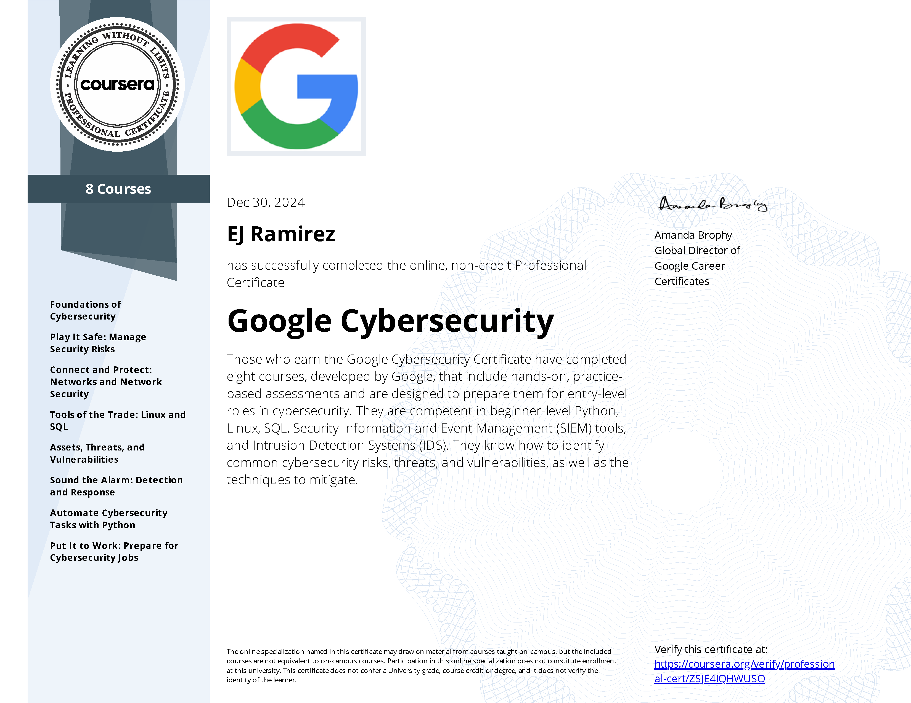
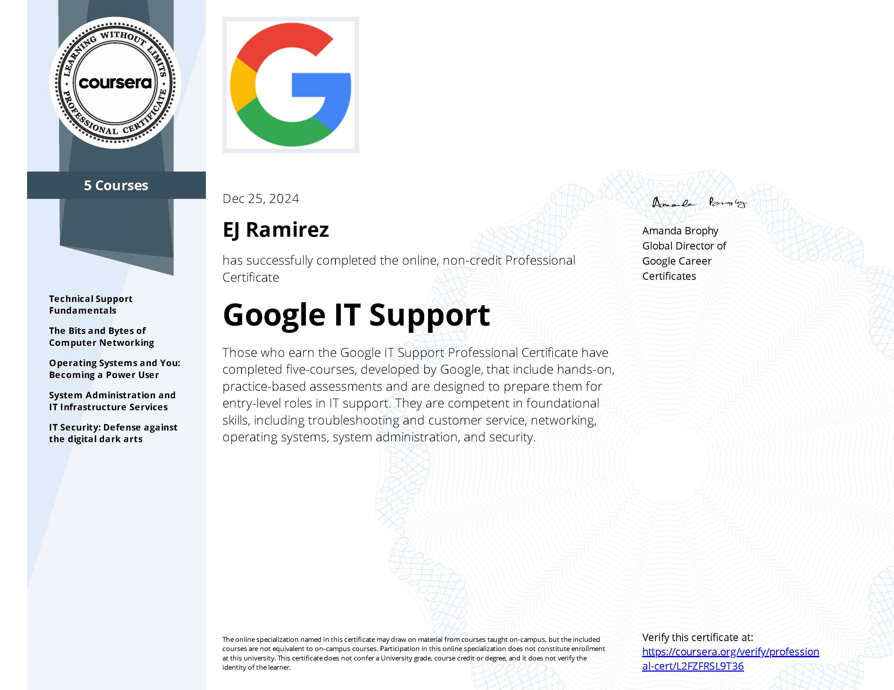
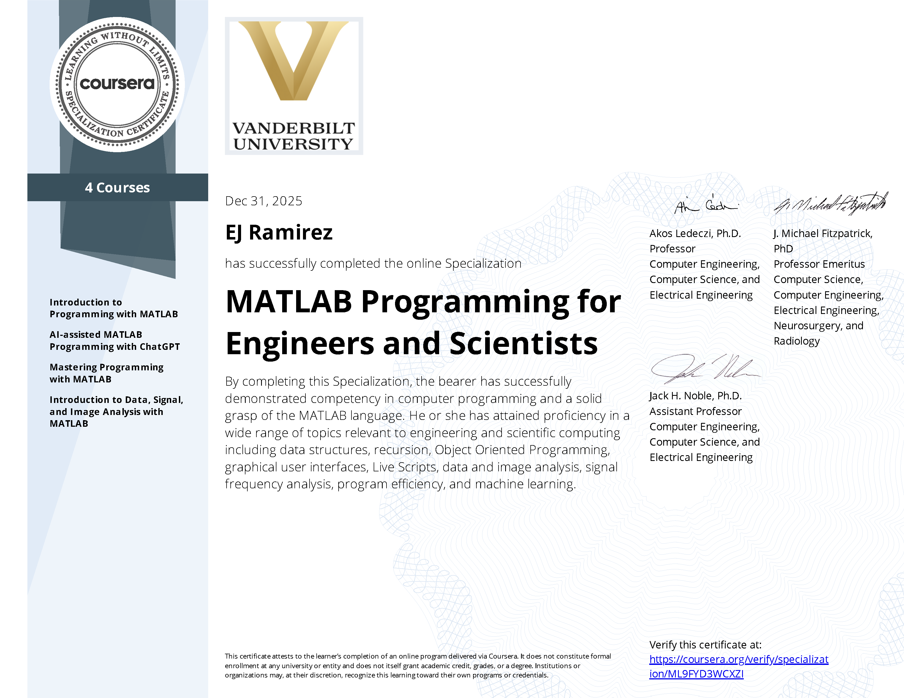

`< Hello there! />` 
----------------------------
# I'm [EJ S. Ramirez](https://www.linkedin.com/in/ej-ramirez-19b1632b5/) 👨‍💻

 I am a Computer Engineering professional currently pursuing my Master's degree in Computer Engineering. My expertise lies in Edge AI, Computer Vision, and Embedded Systems Design. Experienced in deploying machine learning models on edge devices (e.g., Raspberry Pi), designing automated hardware systems with microcontrollers, and investigating deep learning architectures for real-world applications. I am passionate about bringing efficient, intelligent systems to life in the physical world.

 
## 🎓 Education

  
  <b>Master of Science in Computer Engineering (MSCpE)</b> 
  Mapúa University 
   12/2025 - Present &nbsp;&nbsp;|&nbsp;&nbsp;  Muralla St 1002 Manila, Philippines

 

  

  
  <b>Bachelor of Science in Computer Engineering</b> 
  North Eastern Mindanao State University (NEMSU) 
   08/2020 - 06/2024 &nbsp;&nbsp;|&nbsp;&nbsp;  Cantilan, Surigao del Sur

 

 

  
  <b>Science Technology Engineering and Mathematics (STEM)</b> 
  Cantilan National High School 
   06/2018 - 03/2020 &nbsp;&nbsp;|&nbsp;&nbsp;  Cantilan, Surigao del Sur

 

## 🎯 Specializations

  <b> Artificial Intelligence and Deep Learning</b> 
  &nbsp;&nbsp;&nbsp;&nbsp;&nbsp;&nbsp;&nbsp;&nbsp;&nbsp;&nbsp;&nbsp;&nbsp;<i>Frameworks:</i>  
  &nbsp;&nbsp;&nbsp;&nbsp;&nbsp;&nbsp;&nbsp;&nbsp;&nbsp;&nbsp;&nbsp;&nbsp;

 

  <b> Programming Fundamentals</b> 
  &nbsp;&nbsp;&nbsp;&nbsp;&nbsp;&nbsp;&nbsp;&nbsp;&nbsp;&nbsp;&nbsp;&nbsp;<i>Languages:</i>  
  &nbsp;&nbsp;&nbsp;&nbsp;&nbsp;&nbsp;&nbsp;&nbsp;&nbsp;&nbsp;&nbsp;&nbsp;

 

  <b> Embedded Systems & IoT</b> 
  &nbsp;&nbsp;&nbsp;&nbsp;&nbsp;&nbsp;&nbsp;&nbsp;&nbsp;&nbsp;&nbsp;&nbsp;<i>Hardwares:</i>  
  &nbsp;&nbsp;&nbsp;&nbsp;&nbsp;&nbsp;&nbsp;&nbsp;&nbsp;&nbsp;&nbsp;&nbsp;

 

  <b> Edge Computing & AI Deployment</b> 
  &nbsp;&nbsp;&nbsp;&nbsp;&nbsp;&nbsp;&nbsp;&nbsp;&nbsp;&nbsp;&nbsp;&nbsp;<i>Technologies:</i>  
  &nbsp;&nbsp;&nbsp;&nbsp;&nbsp;&nbsp;&nbsp;&nbsp;&nbsp;&nbsp;&nbsp;&nbsp;

 

  <b> IT & Workspace Administration</b> 
  &nbsp;&nbsp;&nbsp;&nbsp;&nbsp;&nbsp;&nbsp;&nbsp;&nbsp;&nbsp;&nbsp;&nbsp;<i>Platforms:</i>  
  &nbsp;&nbsp;&nbsp;&nbsp;&nbsp;&nbsp;&nbsp;&nbsp;&nbsp;&nbsp;&nbsp;&nbsp;
  

 

  <b> Other Development Tools</b>  
  &nbsp;&nbsp;&nbsp;&nbsp;&nbsp;&nbsp;&nbsp;&nbsp;&nbsp;&nbsp;&nbsp;&nbsp;

 

## 🔬 Research Projects & Thesis

  <b><a href="https://github.com/ejramirez525/Automated-Gastropod-Species-Classification-Using-Deep-Learning">Development of Gastropods' Taxonomic Classification Using Deep Learning</a></b> 
  <i>Undergraduate Thesis</i> &nbsp;&nbsp;|&nbsp;&nbsp; 🏆 Best Thesis (BSCpE) 
  Department of Computer Studies Research Exhibit 2024

 

  <b><a href="https://github.com/ejramirez525/Automated-Height-Weight-and-Body-Mass-Index-Measurement-System">Automated Height, Weight, and Body Mass Index Measurement System Using Load Cell and TOF10120 Laser Sensing Technology</a></b> 
  <i>Special Project in Methods of Research</i> &nbsp;&nbsp;|&nbsp;&nbsp; 🎖️4th Placer 
  NEMSU Cantilan Research Festival 2023

 

  <b><a href="https://github.com/ejramirez525/Typhoon-Resilient-Smart-Laboratory-Access-and-Monitoring-System">Development of a Typhoon-Resilient Smart Laboratory Access and Monitoring System Using Asynchronous Task Scheduling</a></b> 
  <i>Project in Real-Time Embedded Systems</i> 
  Arduino Mega 2560, RFID, Sensors, and Actuators

 

  <b><a href="https://github.com/ejramirez525/Simple-Bird-Species-Classifier-Architecture-Based-on-Multi-Layer-Perceptron">Simple Bird Species Classifier Architecture Based on Multi-Layer Perceptron (MLP)</a></b> 
  <i>Project in Neural Networks</i> 
  Multi-Layer Perceptron, 200 Bird Species Dataset, PyTorch, and Google Colab

 

## 📜 Certifications & Eligibility

 

<b>🎖️ Civil Service Professional Eligibility</b> (Civil Service Commission)

 

  

## 📫 Let's Connect & Research

  <b> Professional & Academic Profiles</b> 
  &nbsp;&nbsp;&nbsp;&nbsp;&nbsp;&nbsp;&nbsp;&nbsp;&nbsp;&nbsp;&nbsp;&nbsp;<i>Let's collaborate on Edge AI, Deep Learning, and Embedded Systems!</i>  
  &nbsp;&nbsp;&nbsp;&nbsp;&nbsp;&nbsp;&nbsp;&nbsp;&nbsp;&nbsp;&nbsp;&nbsp;

