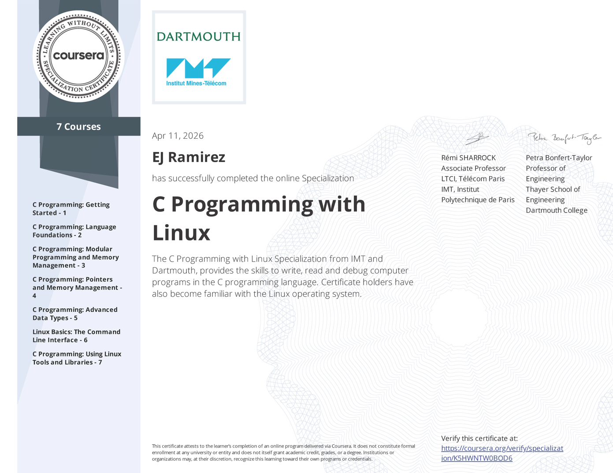

  
  <h1>Hi, I'm EJ S. Ramirez 👨‍💻</h1>

  
  
  

  
  
  

  I am a <b>Computer Engineering professional</b>, <b>educator</b>, and <b>researcher</b> with a strong interest in <b>Edge AI</b>, <b>Computer Vision</b>, <b>Embedded Systems</b>, and <b>Software Engineering Education</b>. I design intelligent systems that bridge software, hardware, and practical deployment on devices like Raspberry Pi and microcontrollers, while also teaching students in <b>Java</b>, <b>C#</b>, <b>.NET</b>, <b>HTML</b>, and <b>CSS</b>.

  
  

---

## 🧑‍🏫 Teaching

  <table>
    <tr>
      <td width="25%" align="center">
         
        <b>Java</b> 
        OOP and software fundamentals
      </td>
      <td width="25%" align="center">
         
        <b>C#</b> 
        Application development and logic
      </td>
      <td width="25%" align="center">
         
        <b>HTML</b> 
        Web structure and interface design
      </td>
      <td width="25%" align="center">
         
        <b>CSS</b> 
        Styling and user experience
      </td>
    </tr>
  </table>

---

## 🔬 Research

  <table>
    <tr>
      <td width="33%" align="center">
         
        <b>AI & Deep Learning</b> 
        Computer vision, intelligent classifiers, and efficient model design
      </td>
      <td width="33%" align="center">
         
        <b>Embedded Systems</b> 
        Hardware-aware design with microcontrollers, sensors, and automation
      </td>
      <td width="33%" align="center">
         
        <b>Edge Computing</b> 
        Deploying ML on edge devices for real-time decision-making
      </td>
    </tr>
  </table>

---

## 🧠 Core Expertise

  
  
  
  
  
  
  
  
  
  
  
  
  
  
  

---

## 🎓 Education & Experience

  
  <b>Master of Science in Computer Engineering (MSCpE)</b> 
  Mapúa University • 2025 - Present 
  Muralla St., Intramuros, Manila, Philippines

 

  
  <b>Bachelor of Science in Computer Engineering</b> 
  North Eastern Mindanao State University • 2020 - 2024 
  Cantilan, Surigao del Sur

 

  
  <b>ICT Educator</b> 
  Saint Micheal College, Cantilan, Incorporated • 2026 - Present 
  Cantilan, Surigao del Sur

 

---

## 🔬 Featured Research & Projects

- <b><a href="https://github.com/ejramirez525/Automated-Gastropod-Species-Classification-Using-Deep-Learning">Gastropod Taxonomic Classification Using Deep Learning</a></b>
  - Undergraduate thesis
  - <i>🏆 Best Thesis (BSCpE)</i>
  - Department of Computer Studies Research Exhibit 2024

- <b><a href="https://github.com/ejramirez525/Automated-Height-Weight-and-Body-Mass-Index-Measurement-System">Automated Height, Weight, and BMI Measurement System</a></b>
  - Load cell + TOF10120 laser sensing
  - <i>🎖️ 4th Placer</i>
  - NEMSU Cantilan Research Festival 2023

- <b><a href="https://github.com/ejramirez525/Typhoon-Resilient-Smart-Laboratory-Access-and-Monitoring-System">Typhoon-Resilient Smart Laboratory Access System</a></b>
  - Real-time embedded systems and asynchronous scheduling
  - Arduino Mega 2560, RFID, sensors, and actuators

- <b><a href="https://github.com/ejramirez525/Simple-Bird-Species-Classifier-Architecture-Based-on-Multi-Layer-Perceptron">Bird Species Classifier using MLP</a></b>
  - Neural networks and PyTorch experimentation
  - Multi-layer perceptron architecture with bird dataset

---

## 🏅 Certifications & Credentials

  

  
  
  
  
  
  

---

## 📫 Let’s Connect

  I’m open to collaborations in <b>Edge AI</b>, <b>computer vision</b>, <b>embedded intelligence</b>, and <b>research-driven engineering</b>.

  
  
  

  

